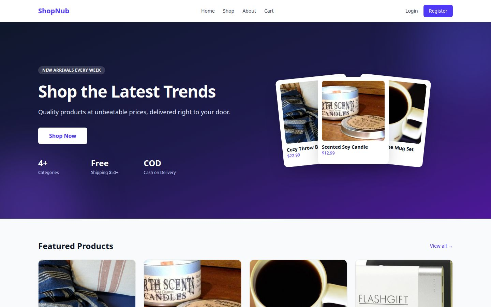
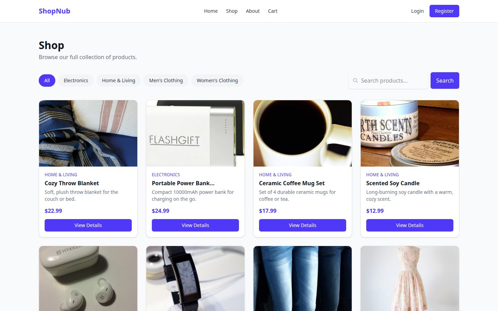
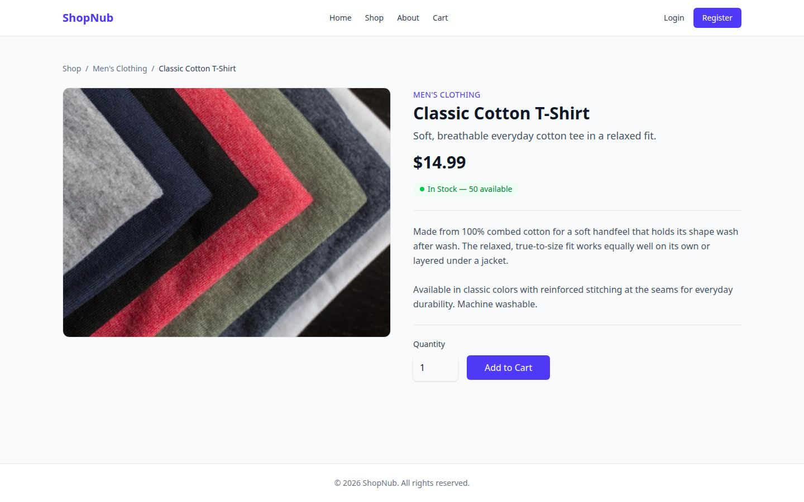

# ShopNub — Basic E-Commerce Web Application

A basic ecommerce web application built with Laravel, Blade, Tailwind CSS, and MySQL as a university project.

Customers can browse products, search and filter by category, manage a session-based shopping cart, check out, and view their order history. Admins get a separate panel to manage categories, products (with image upload), orders, and customers.

## Student Information

* **Name:** Rakib Hossain
* **Student ID:** 41240102110
* **GitHub Repository:** https://github.com/rakib6120/ecommerce-nub

## Technology Stack

* **Laravel 13** — routing, authentication, validation, Eloquent ORM, database transactions
* **Blade** — server-side templates and layouts (storefront and admin)
* **Tailwind CSS 4** — styling, via `@tailwindcss/vite`
* **MySQL** — relational database
* **Vite** — frontend asset bundling

No frontend JavaScript framework (React, Vue, Alpine.js) or admin template is used — plain Blade and Tailwind throughout, kept intentionally simple.

## Main Features

### Customer

* Browse the home page, shop page, and About Us page
* Search products by name and filter by category (combinable, server-side)
* View product details (image, price, short and full description, stock)
* Register, log in, and log out
* Session-based shopping cart: add, update quantity, remove items; live cart count in the navbar
* Checkout with delivery details, validated server-side
* Order placement: server-side stock re-check, total calculation, and stock deduction inside a database transaction
* Order confirmation page
* Customer dashboard with account info
* "My Orders" list and per-order details, scoped to the logged-in customer only

### Admin

Accessible only to users with the `admin` role (see [Creating an Admin User](#creating-an-admin-user) below):

* Dashboard with product/category/order/customer counts and the 5 most recent orders
* Category management: list, create, edit, delete (blocked if products still belong to the category)
* Product management: list, create, edit, delete, with image upload (JPG/PNG/WEBP, max 2MB)
* Order management: list, view details, update status (pending/processing/completed/cancelled)
* Customer management: list (customers only, not other admins), with per-customer order history and total spent

## Requirements

* PHP 8.3+
* Composer
* MySQL
* Node.js and npm
* Git

## Installation

### 1. Clone the repository

```bash
git clone https://github.com/rakib6120/ecommerce-nub.git
cd ecommerce-nub
```

### 2. Install dependencies

```bash
composer install
npm install
```

### 3. Set up the environment file

```bash
cp .env.example .env
php artisan key:generate
```

### 4. Configure the database

Create a MySQL database, then edit `.env`:

```env
DB_CONNECTION=mysql
DB_HOST=127.0.0.1
DB_PORT=3306
DB_DATABASE=ecommerce_nub
DB_USERNAME=root
DB_PASSWORD=
```

### 5. Run migrations and seed sample data

```bash
php artisan migrate --seed
```

This creates all tables and seeds:

* 4 categories and 10 products, each with a real product photo (downloaded once during seeding and cropped to a consistent square) and both a short and full description
* A test customer account: `test@example.com` / `password`
* A ready-to-use admin account: `admin@example.com` / `password` (see [Creating an Admin User](#creating-an-admin-user) for promoting additional accounts)

### 6. Link storage for product images

```bash
php artisan storage:link
```

Required for uploaded product images to be publicly accessible.

### 7. Build frontend assets

For development (with hot reload):

```bash
npm run dev
```

For a one-off production build:

```bash
npm run build
```

### 8. Run the app

```bash
php artisan serve
```

Visit `http://127.0.0.1:8000`.

## Creating an Admin User

Seeding already creates a ready-to-use admin account: `admin@example.com` / `password`. Log in with it and visit `/admin`.

To promote a different account to admin (new registrations always get the `customer` role — this is intentional, since `role` is not mass-assignable and can't be set through the registration form), register normally through the app, then run:

```bash
php artisan tinker --execute="
\$user = App\Models\User::where('email', 'your-email@example.com')->first();
\$user->role = 'admin';
\$user->save();
"
```

## Useful Commands

```bash
# Reset the database and reseed sample data
php artisan migrate:fresh --seed

# List all routes
php artisan route:list

# Run the test suite (if tests are present)
php artisan test

# Clear cached config/views/routes
php artisan optimize:clear
```

## Project Structure Notes

* `app/Http/Controllers/` — storefront controllers at the top level, admin controllers under `Admin/`
* `app/Models/` — `User`, `Category`, `Product`, `Order`, `OrderItem`
* `app/Services/CartService.php` — the session-based cart (no `carts` database table; cart contents live in the session)
* `resources/views/layouts/` — separate `storefront.blade.php` and `admin.blade.php` layouts
* `resources/views/storefront/`, `resources/views/admin/` — page views, mirroring the controller structure
* `resources/views/components/` — shared Blade components (`flash-messages`, `empty-state`)

## Notes

* This project does not integrate a real payment gateway — checkout is Cash on Delivery only.
* Product/category/order data is intentionally simple (no variants, coupons, reviews, or wishlists) to keep the scope appropriate for a university submission.
* `ProductSeeder` downloads one real product photo per product from the internet during seeding, so `php artisan migrate --seed` needs network access the first time. If it's unavailable, seeding still succeeds — each product falls back to a clean, locally generated placeholder image instead.

## Demo

**Homepage**



**Shop page**



**Product details page**


